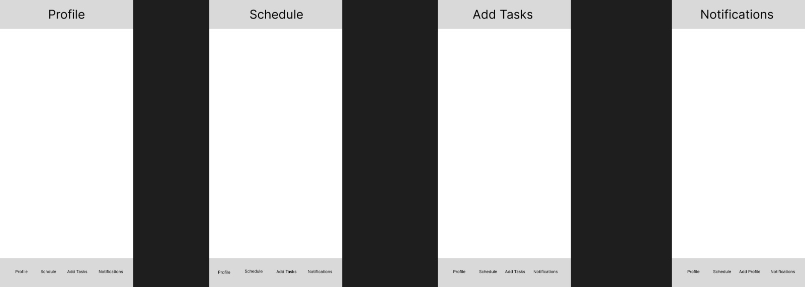

Original App Design Project - README Template
===

# SavedbytheBlock

## Table of Contents
1. [Overview](#Overview)
2. [Product Spec](#Product-Spec)
3. [Wireframes](#Wireframes)
4. [Schema](#Schema)

## Overview
### Description
This app is designed to serve as a task coordinator for users. The app will be a tool for those that struggle with disorganization,  time management, as well as procrastination making it easier to break bad habits and accomplish daily and/or weekly goals and responsibilities.

### App Evaluation
[Evaluation of your app across the following attributes]
- **Category: Business/Productivity**
- **Mobile: The app is to be feasible for iOS devices and compatible watches.**
- **Story: Analyzes users current schedule, responsibilities, as well as the goals they would like to accomplish (i.e better sleep schedule, more study sessions, personal time etc)  and will output different block schedules for the user to choose from that will help them visualize how to allocate their time more wisely.**
- **Market: There is a very large market for this app. The app will cover a massive user base that people of all ages on both computer and mobile devices will be able to use. This app will provide a large value to a niche group of people because it will make sure people who have a hard time keeping things on schedule are better with this problem.**
- **Habit: The intent is to have the user on the app daily or as needed.**
- **Scope: This app will probably be somewhat challenging but, for the most part, it will be considered moderate by the time we are at the end of the program. A stripped down version of this app will still be very interesting to build because it doesn’t require things to be too complicated. The product is clearly defined.**

## Product Spec

### 1. User Stories (Required and Optional)

**Required Must-have Stories**

* User (new) logs in and is prompted to enter recurring schedule
* User will include goals they’d like to achieve (daily 8 hours of sleep, gym 3 times a week, 6 hours dedicated to studying etc)
* Program will distribute allotted time between users tasks/responsibilities while also taking personal goals into consideration.
* User will have multiple block schedule options (if applicable) to choose which is better suited for them.

**Optional Nice-to-have Stories**

* Users have a friends list and can add one another.
* Users have the option to make their schedule private or public for their friends to see. If private, other users are able to see if they are busy/available without disclosing task information.

### 2. Screen Archetypes

* Login Screen
   * User can login

* Registration Screen 
   * User can create a new account
  
* Tasks Screen - Insert upcoming responsibilities
   * Users input their upcoming goals for the week.

* Schedule/Calendar selection
   * Sorted block schedule for the day/week is shown.

### 3. Navigation

**Tab Navigation** (Tab to Screen)

* Profile
* Schedule/calendar selection
* Add Tasks
* Notifications

**Flow Navigation** (Screen to Screen)

* Welcome Screen
   * When the app launches the user is welcomed with the logo and navigated to the welcome page, where the user is prompted to sign up or log in.

* Schedule/Calendar selection
   * Once the user logs in they are navigated to the schedule screen where their adjusted block schedule is displayed. If they are a new user, they will be prompted to add a task to get started.
    
* Profile Page
   * Allows the user to fill in information about themselves.

* Add Tasks
   * User will be able to adjust (add/delete) schedule and tasks accordingly 

* Notifications 
   * The app will alert users of upcoming events and responsibilities within the time frame of users choosing.

## Wireframes

### [BONUS] Digital Wireframes & Mockups

### [BONUS] Interactive Prototype

## Schema 
[This section will be completed in Unit 9]
### Models
[Add table of models]
### Networking
- [Add list of network requests by screen ]
- [Create basic snippets for each Parse network request]
- [OPTIONAL: List endpoints if using existing API such as Yelp]
